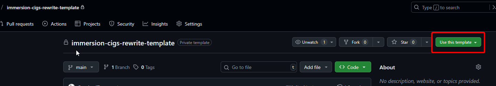
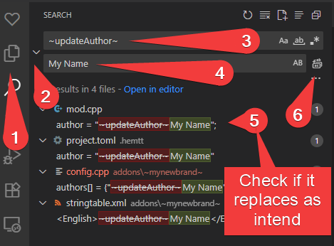
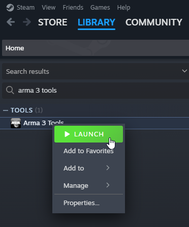
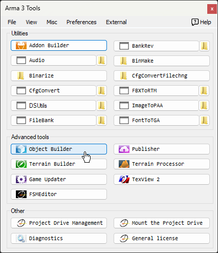
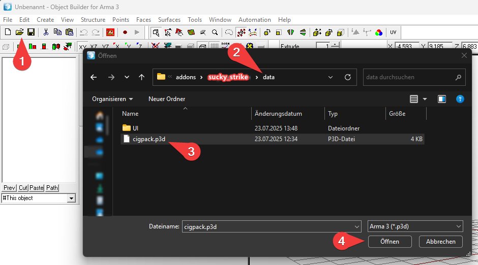
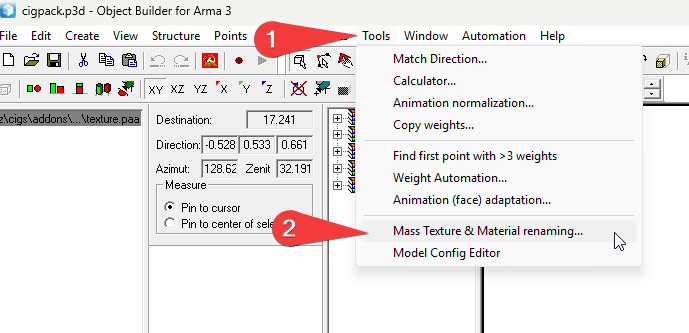
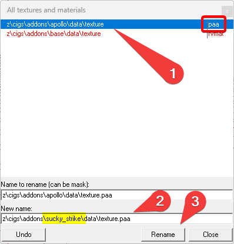
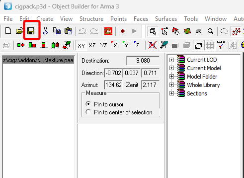

## How to Create a new Cigarette Brand - The most basic way  - a walkthrough

This example will
- be a simple retexture
- not change the cigarette models (besides the texture)
- not change the cigarette package model (besides the texture)
- not use a custom .rvmat file
- not change any other config related stuff
- will assume a brandname of `Sucky Strike`, as you surely know, you'll have to adapt it to your own liking.

### 1. Get the template files and establish your workspace

Click me to reveal

 

Create a Repository based on the Template Repository

### 2. Rename the folder `addons\~mynewBrand~` -> `addons\sucky_strike`

Click me to reveal

 

- Can not have whitespaces, instead use `_`
- use lower case
- **Can not be an already existing brand(addon) name from the `immersion cigs - rewrite` mod**.

### 3. Open the Repository in VS Code and use Search and Replace

Click me to reveal

 

- Replace the following `~placeholders~` across the whole mod directory!
- make sure to remove the `~`. These merely indicate the placeholders.

1. `~updateBrandName~` -> `sucky_strike`.
   - needs to be exact as the addon folder name
   - no whitespaces
2. `~updateBrandNameBeautified~` -> `Sucky Strike`.
   - Should be Capitalized
   - Can have Whitespaces
3. `~updateAuthor~` -> `LeetHaxor [1337]`
   - Put your Username or whatever you want to be credited with
   - Can have Whitespaces
4. `~updateURL~` -> `https://github.com/LeetHaxor/immersion-cigs-extension-sucky_strike`
   - Can be any link, commonly used to direct to YOUR mods github repo

### 4. Edit the Texture Path of the cigpack.p3d

Click me to reveal

 

#### 1. Open Arma 3 Tools

#### 2. Open Object Builder

#### 3. Open cigpack.p3d

#### 4. Open Mass Texture Renaming Tool

#### 5. Update the Path tho the .paa texture

#### 6. Save Changes to the cigpack.p3d file

### 5. (Optional) Adjust Cigarette Burn Time and Cigpack Size

Click me to reveal

 

- Open and edit `addons\sucky_strike\defines.hpp`
- follow provided advice inside

### 6. Update textures

Click me to reveal

Within the Mod Folder Structure, you will find the folder `\photoshop-files\`. Inside, you'll find mutliple folders each with a template `.psd` and other resource files, to make the creation of new addons easier.

- `addon\sucky_strike\data\texture.paa`
  - The texture file for the 3d Models of both, the cig-pack as well as for the individual cigarette stages.
- `addon\sucky_strike\data\UI\gear_cigpack_x_ca.paa`
  - The Inventory Icon for the cigarette pack.
- `addon\sucky_strike\data\UI\gear_cig0_x_ca.paa` .. `gear_cig4_x_ca.paa` (Optional)
  - This step isnt exactly required if the cigarettes are very similar to the template textures. Details wont be very visible. If you change the Color of the cigarettes, you might want to consider the change though.
  - The Inventory Icons for each individual stage of the cigarette.
    - `cig0` is the unused cigarette.
    - `cig1` .. `cig4` is the burning cigarette during its different stages (shorter).
- `img\mod-rw-trans.paa` (Optional)
  - This is the Image used by the mod as as mod icon and shall support transparancy

 

### 7. Update `stringtable.xml`

Click me to reveal

 

The Stringtable.xml will contain the localized text for your cigarette brand. Here, you will be able to change the following:
- Displayname Cigarettes
- Displayname Cigpacks
- Description Cigpacks
- Author
- URL

#### Linebreak

To place an linebreak within an items description, the following has to be used: `&lt;br/&gt;`

### 8. Build and test the mod by using hemtt

Click me to reveal

 

[VSCode Docs: How to use the Terminal](https://code.visualstudio.com/docs/terminal/getting-started)
[Hemtt Docs: Launch](https://hemtt.dev/commands/launch.html)

### 9. Publish the Mod

Click me to reveal

 

[VSCode Docs: How to use the Terminal](https://code.visualstudio.com/docs/terminal/getting-started)
[Hemtt Docs: Launch](https://hemtt.dev/commands/release.html)

Once you're happy with the state of the mod, you can use `hemtt release` to build the mod.
Take the .zip and use the `Arma 3 Publisher` from `Arma 3 Tools` to release your mod.

